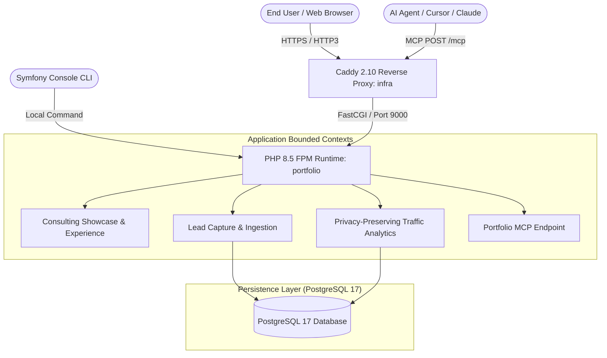

# Architecture Documentation - portfolio (bahdanhal.pl)

`portfolio` (`bahdanhal.pl`) is the consulting portfolio, engineering showcase, and contact lead ingestion application for Bahdan Hal.

---

## 1. System Overview & Core Principles



### Architectural Principles

1. **Clean Architecture & Domain-Driven Design (DDD)**
   - Business logic and lead domain concepts are modeled in pure PHP (`src/Lead/Domain/`, `src/Analytics/Domain/`).
   - Use cases and orchestration reside in application services (`src/Lead/Application/`, `src/Analytics/Application/`).
   - Persistence and framework integrations reside in infrastructure adapters (`src/Lead/Infrastructure/`, `src/Analytics/Infrastructure/`).
   - Presentation is handled via Symfony controllers (`src/Controller/`).

2. **Strict Privacy & Anti-Abuse Protection**
   - Contact leads require email or phone validation, enforce honeypot checks (`company` trap field), origin validation, and rate limiting (5 submissions per IP per day).
   - Client IPs and visitor tracking are irreversibly salted and hashed with HMAC-SHA256 (`visitor_hash`).
   - Page view tracking respects `DNT` and `Sec-GPC` privacy headers and filters automated bots and internet scanner probe paths.

3. **Model Context Protocol (MCP) Integration**
   - Exposes public and authenticated tools at `/mcp` via `symfony/mcp-bundle` and `mcp/sdk`.
   - Public tools: `get_portfolio_overview`, `get_services_and_pricing`, `get_cv_and_skills`, `submit_contact_lead`.
   - Admin tools: `get_admin_dashboard_statistics` (including privacy-preserving `ai_telemetry` with tool & endpoint breakdowns, strictly excluding admin tool self-counts), `list_admin_contact_leads`.

4. **AI Discovery & Markup**
   - Provides standardized `/llms.txt` and comprehensive `/llms-full.txt` documentation.
   - Embeds Schema.org JSON-LD structured data including `OfferCatalog` and `Offer` rates.

---

## 2. Directory Layout

```
portfolio/
├── config/                      # Symfony bundle & service configuration
├── migrations/                  # Doctrine database migrations (leads, page_views)
├── public/                      # Static assets (CSS, JS, images, llms.txt)
├── specs/                       # MCP tool specifications (mcp-tools.spec.json)
├── src/
│   ├── Analytics/               # Privacy-preserving page view tracking
│   │   ├── Application/         # TrafficAnalytics queries
│   │   ├── Domain/              # PageView entity and repository interface
│   │   └── Infrastructure/      # DoctrinePageViewRepository & PageViewSubscriber
│   ├── Command/                 # Scheduled pruning CLI commands
│   │   └── PruneExpiredDataCommand.php
│   ├── Controller/              # Presentation layer
│   │   ├── Admin/               # PortfolioAdminController (leads & analytics dashboard)
│   │   └── PortfolioController.php # Landing page, contact lead ingestion, sitemap
│   ├── Entity/                  # Doctrine ORM entities (LeadEntity, PageViewEntity)
│   ├── Lead/                    # Contact lead capture context
│   │   ├── Application/         # CaptureLead use case
│   │   ├── Domain/              # Lead domain model and LeadRepository interface
│   │   └── Infrastructure/      # DoctrineLeadRepository
│   ├── Mcp/                     # MCP tool handlers
│   │   ├── AdminAccess.php      # Bearer token security guard
│   │   ├── AdminTools.php       # Admin MCP tools
│   │   └── PortfolioPublicTools.php # Public MCP tools
│   └── Shared/                  # Shared domain value objects & HTTP helpers
├── templates/                   # Twig templates (base, portfolio, admin)
├── tests/                       # PHPUnit test suites & spec compliance tests
└── translations/                # Bilingual translations (messages.en.yaml, messages.pl.yaml)
```

---

## 3. Verification & Quality Invariants

All changes must pass the strict verification pipeline:

```bash
docker run --rm -v "$PWD:/app" -w /app/portfolio -e APP_ENV=test bahdan-landing-test vendor/bin/phpunit --fail-on-phpunit-notice
docker run --rm -v "$PWD:/app" -w /app/portfolio bahdan-landing-test vendor/bin/phpstan analyse --no-progress --memory-limit=512M
docker run --rm -v "$PWD:/app" -w /app/portfolio bahdan-landing-test vendor/bin/phpcs
docker run --rm -v "$PWD:/app" -w /app/portfolio bahdan-landing-test php bin/console lint:twig templates
docker run --rm -v "$PWD:/app" -w /app/portfolio bahdan-landing-test php bin/console lint:yaml translations config
docker run --rm -v "$PWD:/app" -w /app/portfolio bahdan-landing-test composer validate --strict --no-check-publish
```
