# Architecture Documentation — Bahdan’s Ecosystem

Bahdan’s Ecosystem is a distributed multi-service architecture comprising 3 specialized web applications and a unified reverse proxy/infrastructure layer.

---

## 1. System Overview & Multi-Repo Topology

```mermaid
graph TD
    User([End User / Web Browser]) -->|HTTPS / HTTP3| Caddy[Caddy 2.10 Reverse Proxy: infra]
    Agent([AI Agent / Cursor / Claude]) -->|MCP POST /mcp| Caddy

    subgraph "Infrastructure & Routing (infra/)"
        Caddy -->|bahdanhal.pl / bahdan-hal.ovh| PortfolioApp[portfolio: PHP 8.5 / Port 9000]
        Caddy -->|ileza.pl| IlezaApp[ileza: PHP 8.5 / Port 9000]
        Caddy -->|stackhal.com| StackhalApp[stackhal: PHP 8.5 / Port 9000]
    end

    subgraph "ileza (ileza.pl) Bounded Contexts"
        IlezaApp --> MarketContext[Used-Goods Price Index & Radar]
        IlezaApp --> IncomeContext[Polish Employment & Tax Calculator]
        IlezaApp --> IlezaMcp[Market & Income MCP Tools]
    end

    subgraph "stackhal (stackhal.com) Bounded Contexts"
        StackhalApp --> CaddyTranspilerContext[Nginx/Apache to Caddy Transpiler]
        StackhalApp --> PkpassContext[Apple Wallet PKPass Inspector & Debugger]
        StackhalApp --> CidrContext[CIDR Subnet Overlap Matrix]
        StackhalApp --> AuditContext[Technical SEO Crawler & Audit Engine]
        StackhalApp --> GeoContext[GEO Readiness & AI Policy Analyzer]
        StackhalApp --> DomainInspectorContext[DMARC, BIMI, MTA-STS Inspector]
        StackhalApp --> StackhalMcp[Developer Tools MCP Endpoint]
    end

    subgraph "portfolio (bahdanhal.pl)"
        PortfolioApp --> PortfolioContext[Engineering Consulting & Portfolio]
        PortfolioApp --> LeadContext[Private Lead Ingestion]
    end

    subgraph "Persistence Layer (Internal Docker Network)"
        IlezaApp --> PostgreSQL[(PostgreSQL 17 Database)]
        StackhalApp --> PostgreSQL
        PortfolioApp --> PostgreSQL
    end
```

---

## 2. Repositories

| Repository | Domain | Responsibility | Core Routes |
|---|---|---|---|
| **`portfolio/`** | `https://bahdanhal.pl` | Personal engineering brand, case studies, consulting leads | `/`, `/contact`, `/sitemap.xml` |
| **`ileza/`** | `https://ileza.pl` | Polish lifestyle & electronics price index, salary calculator | `/`, `/ceny/{slug}`, `/kalkulator-wynagrodzen`, `/zglos`, `/ceny/{slug}/okazja`, `/mcp` |
| **`stackhal/`** | `https://stackhal.com` | Online developer & infrastructure tool suite | `/caddy-transpiler`, `/apple-pkpass-inspector`, `/cidr-subnet-matrix`, `/seo-audit`, `/geo-audit`, `/domain-inspector`, `/bimi-studio`, `/mcp` |
| **`infra/`** | Global | Caddy 2.10 multi-host reverse proxy, production compose orchestration | SSL termination, FastCGI proxy, isolated database networking |

---

## 3. Shared Architectural Invariants

1. **Strict Database & Network Isolation**:
   PostgreSQL 17 operates exclusively on the internal Docker network with zero exposed host ports. Database credentials are injected via environment files.
2. **Deterministic Processing with Decoupled AI**:
   All core calculations, CIDR math, PKPass parsing, DMARC validation, and used-goods price indexes are 100% deterministic and browser- or rule-based. AI models are strictly optional enhancements for SEO audit summaries.
3. **Strict Privacy & Anti-Scraping Policies**:
   Marketplace URLs voluntarily submitted by visitors are private review material, never fetched automatically, stripped of query strings and fragments, and pruned after 90 days. Client IPs are HMAC-SHA256 hashed.
4. **SSRF Guard with DNS Pinning**:
   Outbound HTTP requests in `stackhal` (SEO crawler, domain inspector) use `SafeHttpFetcher` with strict private/reserved IP filtering and pinned DNS resolution.
