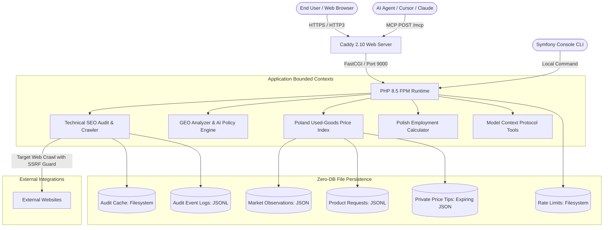
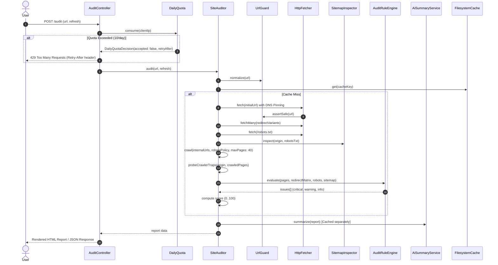
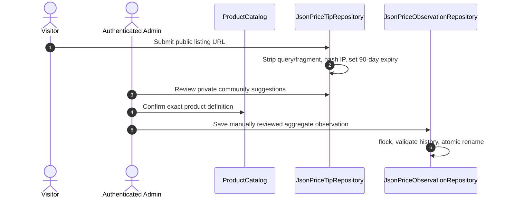

# Architecture Documentation — Bahdan’s Toolbox

Bahdan’s Toolbox (`bahdan-landing`) is a high-performance, privacy-conscious, bilingual web service and agent toolkit. It provides technical SEO auditing, Generative Engine Optimization (GEO) diagnostics, Polish second-hand price indexing, and Polish employment/income tax calculation.

---

## 1. System Overview & Core Principles



### Architectural Principles

1. **Zero External Database (File-Based Storage & Event Logs)**  
   The application operates without an RDBMS or document database. State is maintained across durable, append-only JSONL files (`audit-*.jsonl`, `leads-*.jsonl`, `product-requests-*.jsonl`), atomic versioned JSON records (`{slug}.json`), and filesystem cache adapters.

2. **Deterministic Rules with Decoupled AI Enrichment**  
   Core audits, market observations and signal evaluations are deterministic or manually curated. AI models are invoked only for optional semantic synthesis of technical SEO evidence. System integrity and market prices do not depend on model availability or non-deterministic output.

3. **Strict Privacy & Anti-Scraping Protection**  
   The public market index contains only manually reviewed aggregates. Voluntarily submitted listing URLs are private review material: query strings and fragments are removed, pages are never fetched automatically, and each tip expires after 90 days. Seller details and listing text are never stored. Client IPs are irreversibly hashed using HMAC-SHA256.

4. **SSRF Guard with DNS Pinning**  
   The HTTP fetcher enforces multi-layered Server-Side Request Forgery (SSRF) defenses: private, reserved, and local IP rejection (`FILTER_FLAG_NO_PRIV_RANGE | FILTER_FLAG_NO_RES_RANGE`), hostname validation, and strict DNS resolution pinning to prevent DNS rebinding attacks during crawling.

5. **Multi-Platform AI Abstraction**  
   Optional audit summaries use the `AiClient` interface and Symfony AI Platform, allowing configuration switching between Anthropic and Google Gemini without coupling deterministic audit rules to a model.

---

## 2. Bounded Contexts & Module Layout

The codebase follows Clean Architecture and Domain-Driven Design (DDD) principles:

```
src/
├── Audit/                           # Technical SEO Audit Context (Hexagonal)
│   ├── Application/                 # SiteAuditor, IssueGrouper, AI summary orchestration
│   ├── Domain/                      # Deterministic AuditRuleEngine
│   └── Infrastructure/              # Privacy-safe JSONL audit logger
├── Command/                         # CLI Console Commands
│   ├── AuditCommand.php             # CLI interface for technical SEO audits
│   └── SanitizeMarketDataCommand.php# Normalize legacy market records
├── Controller/                      # Presentation Layer (HTTP Controllers)
│   ├── AuditController.php          # SEO audit web UI, JSON API, contact leads
│   ├── GeoController.php            # GEO analysis web UI & reports
│   ├── MarketController.php         # Used price index UI, configuration views
│   ├── SitemapController.php        # Dynamic XML sitemap with XSL stylesheet
│   └── ToolsController.php          # Portfolio landing, tools index, income calculator
├── Crawl/                           # Shared safe web retrieval context
│   ├── Application/                 # Page and sitemap analysis
│   ├── Domain/                      # Robots policy and unsafe URL exception
│   └── Infrastructure/              # SSRF-safe HTTP fetcher and URL guard
├── Geo/                             # Generative Engine Optimization context
│   └── Application/                 # Deterministic GEO readiness analyzer
├── Income/                          # Polish Income & Tax Calculator Context
│   └── Domain/
│       └── PolishIncomeCalculator.php# 2026 progressive, linear, lump, UoP, UZ tax math
├── Lead/                            # Contact & Lead Capture Context (Hexagonal)
│   ├── Application/
│   │   └── CaptureLead.php          # Lead capture use case
│   ├── Domain/
│   │   ├── Lead.php                 # Lead entity
│   │   └── LeadRepository.php       # Repository interface
│   └── Infrastructure/
│       └── JsonlLeadRepository.php  # Append-only JSONL lead store
├── Market/                          # Used Price Index Context (Hexagonal)
│   ├── Application/
│   │   └── ProductCatalog.php       # Catalog of product families & configurations
│   ├── Domain/
│   │   ├── PriceObservation.php     # Core Value Object with integer grosz math
│   │   ├── PriceObservationRepository.php # Repository interface
│   │   ├── PriceTip.php             # Expiring private community submission
│   │   ├── Product.php              # Product entity with specification attributes
│   │   └── ProductFamily.php        # Aggregation of product configurations
│   └── Infrastructure/
│       ├── JsonPriceObservationRepository.php # Atomic locked JSON storage
│       ├── JsonProductRequestStore.php        # Append-only JSONL request store
│       └── JsonPriceTipRepository.php          # Private 90-day review queue
├── Mcp/                             # Model Context Protocol (MCP) Tools for AI Agents
│   ├── AuditTools.php               # audit_website_seo MCP tool
│   ├── GeoTools.php                 # analyze_geo_readiness MCP tool
│   ├── IncomeCalculatorTools.php    # calculate_polish_income_comparison MCP tool
│   └── MarketPriceTools.php         # list_products, get_history MCP tools
└── Shared/                          # Shared Kernel
    ├── AI/                          # Multi-platform AI abstraction (Anthropic / Gemini)
    │   ├── AiClient.php             # Interface for text/tool completions
    │   ├── AiUseCase.php            # Enum: Summary
    │   └── SymfonyAiClient.php      # Symfony AI Platform adapter (Anthropic/Gemini)
    ├── Application/
    │   └── DailyQuota.php           # Fixed daily window rate quota manager
    └── Domain/                      # Grosz, HashedIp, SafeUrl, DailyQuotaDecision
```

---

## 3. Subsystems & Data Flow

### 3.1 Technical SEO Audit & Crawler Pipeline



### 3.2 Manual Market Review Pipeline



---

## 4. Security & Resilience Architecture

### 4.1 SSRF Prevention (`UrlGuard` + `HttpFetcher`)
External user-supplied URLs present SSRF (Server-Side Request Forgery) risks. The application employs a 4-stage defense:
1. **URL Normalization**: Rejects unsupported protocols (only `http` and `https`), strips inline user/password credentials, and enforces absolute hostnames.
2. **IP Range Filtering**: Disallows private ranges (RFC 1918), loopback (`127.0.0.0/8`, `::1`), link-local (`169.254.0.0/16`), multicast, and reserved ranges via `FILTER_FLAG_NO_PRIV_RANGE | FILTER_FLAG_NO_RES_RANGE`.
3. **DNS Resolution & Validation**: Hostnames are resolved via `dns_get_record(DNS_A | DNS_AAAA)`. Every resolved IP is checked against the private/reserved filters.
4. **Resolution Pinning**: `HttpFetcher` injects the resolved public IP directly into the HTTP client (`resolve: [$host => $resolvedIp]`), ensuring the network connection cannot be hijacked via DNS rebinding between validation and execution.

### 4.2 Rate Limiting & Abuse Prevention
- **SEO & GEO Audits**: 10 audits per client IP per day via `DailyQuota`, backed by a dedicated filesystem rate limit pool (`app.rate_limit_cache`).
- **Contact Leads**: 5 submissions per IP per day + Honeypot check (`company` input field must be empty) + Cross-Origin check (`Origin` header matching host).
- **Product Requests**: 5 submissions per IP per day + Honeypot check + Origin validation.
- **Price Tips**: 5 submissions per IP per day + Honeypot + Origin validation + private 90-day retention.

### 4.3 Atomic File Storage & Concurrency
- `JsonPriceObservationRepository`: Acquires an exclusive lock (`.lock` file via `flock(LOCK_EX)`), reads current historical entries, merges the updated daily observation, sorts chronologically, serializes to a `.tmp` file, and executes an atomic POSIX `rename()` to replace the target file safely under concurrent read/write loads.
- `JsonPriceTipRepository`: Stores each normalized community tip separately so expired material can be deleted without rewriting unrelated records. The repository never performs an HTTP request.
- `AuditLogger`, `JsonlLeadRepository`, `JsonProductRequestStore`: Use `file_put_contents` with `FILE_APPEND | LOCK_EX`.

---

## 5. Model Context Protocol (MCP) Integration

The project exposes a native **Model Context Protocol** endpoint at `/mcp` via `symfony/mcp-bundle` and `mcp/sdk`.

- **Public Endpoint**: `https://bahdanhal.pl/mcp`
- **Transport**: HTTP POST (stateless session with file-backed session IDs).
- **Tools**:
  - `list_polish_used_price_products`: Returns tracked product families, configurations, categories, canonical URLs, and observation availability.
  - `get_polish_used_price_history`: Returns dated asking-price estimates (median, low, high in PLN, sample size, confidence) for a specific product configuration slug.
  - `get_admin_dashboard_statistics`: Returns privacy-preserving traffic, submission trends, SEO audit outcomes and market observation coverage to an authenticated administrator.
  - `list_admin_contact_leads`: Returns recent private consultation requests to an authenticated administrator.
  - `list_admin_product_requests`: Returns requested price-index products to an authenticated administrator.
  - `list_admin_price_tips`: Returns active, expiring listing links awaiting private manual review.
  - `list_admin_recent_audits`: Returns recent sanitized SEO audit runs and operational outcomes.
  - `update_polish_used_price_observation`: Writes a manually reviewed aggregate observation.
- **Administrative authorization**: Admin tools require `Authorization: Bearer <MARKET_ADMIN_TOKEN>`, fail closed when the token is unset, and never accept credentials as tool arguments.
- **Private output**: Administrative list tools omit IP hashes. Their response bodies may still contain contact details or review URLs and must not be logged or forwarded.

---

## 6. Container & Infrastructure Blueprint

```
+-----------------------------------------------------------------------------------+
| Host System (Linux Server: 62.238.1.164)                                          |
|                                                                                   |
|  +-------------------------------------+   +------------------------------------+ |
|  | Web Container (caddy:2.10-alpine)   |   | App Container (php:8.5-fpm-alpine) | |
|  | - Listens: Port 80, 443 (TCP/UDP)   |   | - Listens: FastCGI Port 9000       | |
|  | - Read-only root filesystem         |   | - Read-only root filesystem        | |
|  | - Serves static assets directly     |   | - User: www-data (uid 82, gid 82)  | |
|  | - Proxies PHP to app:9000           |   | - Tmpfs /app/var (128M)            | |
|  +-------------------------------------+   +------------------------------------+ |
|                     |                                         |                   |
|                     +------------------- FastCGI -------------+                   |
|                                                               |                   |
|  +------------------------------------------------------------+-----------------+ |
|  | Docker Volumes                                                               | |
|  | - audit_cache    -> /app/var/audit-cache                                     | |
|  | - audit_logs     -> /app/var/audit-logs                                      | |
|  | - contact_leads  -> /app/var/contact-leads                                   | |
|  | - rate_limits    -> /app/var/rate-limits                                     | |
|  | - market_data    -> /app/var/market-data                                     | |
|  +------------------------------------------------------------------------------+ |
+-----------------------------------------------------------------------------------+
```

---

## 7. Verification & Quality Gates

The continuous verification pipeline ensures 100% adherence to project standards:

| Gate | Tool | Command | Standard |
|---|---|---|---|
| **Unit & Integration Tests** | PHPUnit 12 | `docker run --rm bahdan-landing-test` | 100% passing (0 notices, 0 failures) |
| **Code Style** | PHP_CodeSniffer | `docker run --rm bahdan-landing-test vendor/bin/phpcs --standard=phpcs.xml.dist` | PSR-12 standard (0 errors, 0 warnings) |
| **Template Syntax** | Twig Linter | `docker run --rm bahdan-landing-test php bin/console lint:twig templates` | All templates valid |
| **Configuration Syntax** | YAML Linter | `docker run --rm bahdan-landing-test php bin/console lint:yaml translations config` | All YAML configs valid |
| **AST Knowledge Graph** | Graphify | `graphify . --code-only` + `graphify cluster-only .` | 0 import cycles, 388 nodes indexed |
